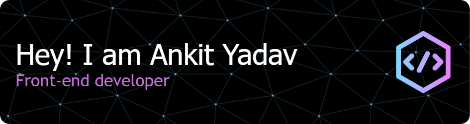

<h1 align="center">Hi 👋, I'm Ankit Yadav</h1>
<h3 align="center">A passionate Frontend Developer & WordPress Enthusiast from India 🇮🇳</h3>

  

  

 

  
  ---
  
  ### 🚀 About Me
  
  I am a developer focused on building responsive websites and managing content management systems. I am currently transitioning from foundational web technologies to advanced frameworks.
  
  - 🔭 I’m currently working with **HTML, CSS, JS, PHP, and WordPress**
  - 🌱 I’m currently learning **React.js & Advanced PHP**
  - 🎯 **My 2026 Roadmap:** Mastering **Next.js, Headless WordPress, and Laravel**
  - 💬 Contact me at: <a href="mailto:itsankityadav.ltd@gmail.com">**itsankityadav.ltd@gmail.com**</a>

  ---

<h3 align="center">🛠️ Languages and Tools</h3>

  <!-- Current Stack -->
  
<strong>Current Tech Stack</strong>

  

    
    
    
    
    
    
    
  

  <!-- Learning / Future Stack -->
  
<strong>Learning & 2026 Goals</strong>

  

    
    
    
    
  

 

<h3 align="center">📊 GitHub Statistics</h3>

  
  

 

  

 

<h3 align="center">🤝 Connect with me</h3>

  

